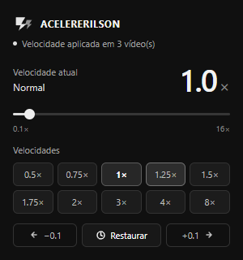

# ⚡ ACELERERILSON — Acelerador de Vídeo

> Controle a velocidade de qualquer vídeo na web com estilo. Rápido, preciso e com visual único.

## 🖼️ Visual da extensão


### Painel de controle



O painel reúne a velocidade atual, os atalhos rápidos e os botões de ajuste fino e restauração.

---

## 🚀 Como Instalar no Google Chrome

1. Abra o Chrome e acesse: `chrome://extensions/`
2. Ative o **Modo do desenvolvedor** (toggle no canto superior direito)
3. Clique em **"Carregar sem compactação"**
4. Selecione a pasta `acelererilson/`
5. A extensão aparecerá na barra de ferramentas — fixe ela clicando no ícone de quebra-cabeça 🧩

---

## 🎮 Como Usar

### Pelo Popup
- Clique no ícone ⚡ na barra do Chrome
- Use o **slider** ou os **botões de atalho rápido** (0.5× a 8×)
- Controle fino com os botões **−0.1** e **+0.1**
- **RESET** volta para velocidade normal (1.0×)

### HUD Overlay
Um indicador flutuante aparece no canto superior direito sempre que a velocidade muda, mostrando a velocidade atual e o modo.

---

## ⚙️ Recursos

- ✅ Funciona em **qualquer site** (YouTube, Netflix, Twitch, etc.)
- ✅ Velocidade de **0.1× até 16×**
- ✅ **Preserva tom de áudio** (`preservesPitch`)
- ✅ **Salva** a velocidade escolhida entre sessões
- ✅ **Detecta novos vídeos** carregados dinamicamente (SPAs, Shadow DOM)
- ✅ HUD flutuante com indicador visual

---

## 📁 Estrutura

```
acelererilson/
├── manifest.json          # Configuração da extensão
├── icons/                 # Ícones (16, 48, 128px)
├── popup/
│   ├── popup.html         # Interface principal
│   ├── popup.css          # Estilo (preto e tons de cinza)
│   └── popup.js           # Lógica do popup
├── content/
│   ├── content.js         # Script injetado nas páginas
│   └── content.css        # Estilo do HUD overlay
└── background/
    └── service_worker.js  # Worker em background
```

---

*ACELERERILSON — Feito com ⚡ para quem não tem tempo a perder*


## Atualização 1.1.1

- Reconecta o controle de vídeo nas abas já abertas ao abrir o popup.
- Consulta os frames separadamente e reúne a quantidade de vídeos encontrados.
- Mostra falhas de acesso e comunicação no popup.
- Reaplica a velocidade escolhida quando o player tenta redefini-la.
- A permissão `scripting` permite carregar o controle nas páginas abertas após recarregar a extensão.

Após atualizar os arquivos, recarregue a extensão em `chrome://extensions/` para aplicar a nova permissão.
